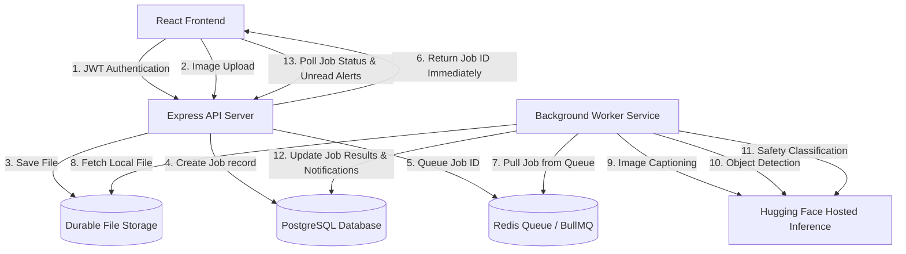

# AI-Powered Media Processing Platform

An asynchronous, queue-based media processing microservice platform. Authenticated users upload images, which are durably stored, enqueued, and processed in the background through a sequential three-step AI pipeline (Image Captioning, Object Detection, and Content Safety Checks) while returning the Job ID immediately.

---

## 1. Architecture Diagram

The system architecture decouples user-facing web servers from resource-intensive AI processing steps using a Redis-backed BullMQ message queue.



---

## 2. Architectural Decisions

Below is the documentation of major architectural decisions, including alternatives, tradeoffs, and final choices:

### Authentication
* **Final Choice**: JSON Web Tokens (JWT).
* **Justification**: JWT is standard, stateless, and scales horizontally since the API server does not need to maintain local session memory. 

### Queue Technology
* **Final Choice**: Redis + BullMQ.
* **Justification**: Extremely fast, native to Node.js/TypeScript, and utilizes Redis (which is also valuable for dashboard caching). BullMQ supports job retries with exponential backoffs and concurrency throttling.

### Storage Strategy
* **Final Choice**: Local disk storage with shared Docker volumes.
* **Justification**: Storing image binaries in PostgreSQL bloats the database and causes severe performance degradation. Mounting a shared volume between the API and Worker containers is simple, free, and sufficient for this scale.

### Notification Strategy
* **Final Choice**: In-App Notifications persisted in PostgreSQL.
* **Justification**: Simpler to maintain and deploy. Notification models link users to their job results.

### Status Update Strategy
* **Final Choice**: React Query Polling (5-second interval).
* **Justification**: Much lower operational complexity than WebSockets. We optimize polling by evaluating active jobs; polling stops automatically once all active jobs reach a final state (`completed` or `failed`).

### Deployment Strategy
* **Final Choice**: Decoupled Cloud/PaaS Deployment compatible with managed free/low-cost tiers.
  * **Frontend**: Vercel (Free Tier) or Netlify (Free Tier).
  * **Backend API**: Render Web Service.
  * **Worker**: Render Background Worker consuming the same BullMQ queue.
  * **Database**: Neon Serverless PostgreSQL (Free Tier - 0.5 GiB storage).
  * **Redis Queue**: Upstash Redis (Free Tier - 10,000 requests/day, ideal for serverless BullMQ).
  * **Storage**: Local disk (Render persistent disk or Docker volume).
  * **AI Services**: Hugging Face hosted inference through one token or a rotating token pool.

### AI Provider Strategy
* **Final Choice**: Hugging Face hosted inference for captioning, object detection, and safety classification.
* **Why Google Vision was removed**: Google Cloud Vision API now requires Google Cloud billing setup for this project path, which makes it unsuitable for a deployable assessment that should run on Vercel, Render, Neon, and Upstash without Google Cloud billing.
* **Why Hugging Face was selected**: Hugging Face Inference Providers expose hosted models through one token or a token pool, support direct HTTP usage from Node.js workers, and avoid local inference servers, local model hosting, or GPU requirements.
* **Model configuration**:
  * Captioning: Defaults to `meta-llama/Llama-4-Scout-17B-16E-Instruct:groq` through the Hugging Face router, with `HUGGINGFACE_CAPTION_MODEL` left configurable.
  * Object Detection: `facebook/detr-resnet-50` is available through HF Inference and returns labels, scores, and boxes.
  * Safety Classification: `Falconsai/nsfw_image_detection` is available through HF Inference and returns image-classification labels with confidence scores.
* **Tradeoffs**: Hosted inference removes local model operations and Google billing, but provider availability, free-tier rate limits, latency, and model routing can change. The configured captioning model is a general vision-language model rather than a dedicated BLIP captioner, so outputs are constrained by a one-sentence prompt and response cleanup.


---

## 3. Technology Choices

* **Frontend**: React, Vite, TypeScript, Tailwind CSS, TanStack React Query, Axios, React Router.
* **Backend**: Node.js, Express, TypeScript, Prisma ORM, JWT, Multer.
* **Database & Caching**: PostgreSQL, Redis, BullMQ.
* **AI Services**: Hugging Face hosted inference for captioning, object detection, and content safety.
* **Containerization**: Docker, Docker Compose.
* **Testing**: Vitest.

---

## 4. Local Setup (Without Docker)

To run the application services locally on your host machine:

### Prerequisites
* Node.js v20+
* PostgreSQL running locally (default port `5432` or similar)
* Redis running locally (default port `6379`)

### Setup Instructions
1. Clone the repository and navigate to the project root.
2. Create a `.env` file in the root based on `.env.example`.
3. Install backend dependencies and run migrations:
   ```bash
   cd backend
   npm install
   # Set DATABASE_URL to localhost:5432 in your .env
   npx prisma db push
   ```
4. Start backend services (open two terminals):
   * Terminal 1 (API Server): `npm run dev:api`
   * Terminal 2 (Worker): `npm run dev:worker`
5. Install frontend dependencies and start Vite:
   ```bash
   cd ../frontend
   npm install
   npm run dev
   ```
6. Open your browser to `http://localhost:3000`.

---

## 5. Docker Setup (Recommended)

Spins up the entire stack (Express API, BullMQ Worker, PostgreSQL, and Redis) locally with a single command.

### Prerequisites
* Docker and Docker Compose installed.

### Setup Instructions
1. Create a `.env` file in the root and fill in your keys:
   ```env
   HUGGINGFACE_API_KEY=your_huggingface_api_key
   HUGGINGFACE_API_KEY_2=your_second_huggingface_api_key_optional
   # Or use HUGGINGFACE_API_KEYS=key_one,key_two,key_three
   APP_TIME_ZONE=Asia/Kolkata
   HUGGINGFACE_CAPTION_MODEL=meta-llama/Llama-4-Scout-17B-16E-Instruct:groq
   HUGGINGFACE_CAPTION_PROMPT=Describe this image in exactly one detailed sentence. Do not use bullet points, multiple sentences, or line breaks.
   HUGGINGFACE_CAPTION_MAX_TOKENS=45
   HUGGINGFACE_IMAGE_MAX_EDGE=768
   HUGGINGFACE_IMAGE_QUALITY=78
   HUGGINGFACE_IMAGE_MAX_BYTES=900000
   JOB_STALE_PROCESSING_MINUTES=15
   HUGGINGFACE_DETECTION_MODEL=facebook/detr-resnet-50
   HUGGINGFACE_DETECTION_THRESHOLD=0.5
   HUGGINGFACE_LABEL_MODEL=meta-llama/Llama-4-Scout-17B-16E-Instruct:groq
   HUGGINGFACE_LABEL_MAX_COUNT=3
   HUGGINGFACE_SAFETY_MODEL=Falconsai/nsfw_image_detection
   HUGGINGFACE_SAFETY_THRESHOLD=0.7
   HUGGINGFACE_SAFETY_REVIEW_MODEL=meta-llama/Llama-4-Scout-17B-16E-Instruct:groq
   HUGGINGFACE_SAFETY_REVIEW_THRESHOLD=0.5
   ```
2. Run the compose environment:
   ```bash
   docker-compose up --build
   ```
3. Docker will compile the TypeScript source files, run Prisma pushes to synchronize Postgres, and launch all servers:
   * **Express API Server**: Accessible on `http://localhost:5000`
   * **PostgreSQL Database**: Port `5472` on host
   * **Redis Server**: Port `6379` on host
4. Run the frontend locally (or inside Docker):
   ```bash
   cd frontend
   npm install
   npm run dev
   ```

---

## 6. Environment Variables

Define the following environment variables in a root `.env` or container settings:

| Variable | Description | Default / Local |
| :--- | :--- | :--- |
| `PORT` | API Server listening port | `5000` |
| `DATABASE_URL` | PostgreSQL connection URL | `postgresql://postgres:postgres_password@db:5432/mediadb` |
| `REDIS_URL` | Redis server connection URL | `redis://redis:6379` |
| `JWT_SECRET` | Signing secret for user authentication | `super_secret_jwt_key_replace_in_prod` |
| `APP_TIME_ZONE` | Local timezone used for dashboard daily upload bucketing | `Asia/Kolkata` |
| `STORAGE_PROVIDER` | File storage provider | `local` |
| `UPLOAD_DIR` | Shared uploads directory | `uploads` |
| `CORS_ORIGIN` | Allowed CORS origins (comma-separated for multiple); set to your frontend URL in production | `*` |
| `HUGGINGFACE_API_KEY` | Hugging Face token with Inference Providers permission | Create at `https://huggingface.co/settings/tokens` |
| `HUGGINGFACE_API_KEY_2` | Optional second Hugging Face token; requests rotate across configured keys | empty |
| `HUGGINGFACE_API_KEYS` | Optional comma-separated Hugging Face token pool; deduped with numbered keys | empty |
| `HUGGINGFACE_CAPTION_MODEL` | Hosted HF router model for image captioning | `meta-llama/Llama-4-Scout-17B-16E-Instruct:groq` |
| `HUGGINGFACE_CAPTION_PROMPT` | Prompt sent with the image for one-line captioning | `Describe this image in exactly one detailed sentence. Do not use bullet points, multiple sentences, or line breaks.` |
| `HUGGINGFACE_CAPTION_MAX_TOKENS` | Maximum caption response tokens requested from the provider | `45` |
| `HUGGINGFACE_IMAGE_MAX_EDGE` | Longest image edge sent to Hugging Face after optimization | `768` |
| `HUGGINGFACE_IMAGE_QUALITY` | JPEG quality used for provider payload optimization | `78` |
| `HUGGINGFACE_IMAGE_MAX_BYTES` | Target maximum optimized image payload bytes before base64 encoding | `900000` |
| `JOB_STALE_PROCESSING_MINUTES` | Worker startup recovery threshold for interrupted `processing` jobs | `15` |
| `HUGGINGFACE_DETECTION_MODEL` | Hosted HF object detection model | `facebook/detr-resnet-50` |
| `HUGGINGFACE_DETECTION_THRESHOLD` | Minimum object confidence persisted as a label | `0.5` |
| `HUGGINGFACE_LABEL_MODEL` | Hosted HF vision-language model for richer visible labels | `meta-llama/Llama-4-Scout-17B-16E-Instruct:groq` |
| `HUGGINGFACE_LABEL_MAX_COUNT` | Maximum persisted semantic labels (subjects, actions, objects) | `6` |
| `HUGGINGFACE_SAFETY_MODEL` | Hosted HF image safety classifier | `Falconsai/nsfw_image_detection` |
| `HUGGINGFACE_SAFETY_THRESHOLD` | Minimum unsafe confidence before `flagged=true` | `0.7` |
| `HUGGINGFACE_SAFETY_REVIEW_MODEL` | Hosted HF vision-language model for abuse/violence/self-harm/distress safety review | `meta-llama/Llama-4-Scout-17B-16E-Instruct:groq` |
| `HUGGINGFACE_SAFETY_REVIEW_THRESHOLD` | Minimum visual safety review confidence before `flagged=true` | `0.5` |

To obtain tokens, create or sign in to a Hugging Face account, open **Settings -> Access Tokens**, create fine-grained tokens, and enable permission to make calls to Inference Providers. Use one token as `HUGGINGFACE_API_KEY`; add `HUGGINGFACE_API_KEY_2` or `HUGGINGFACE_API_KEYS` when you want requests distributed across multiple tokens.

### Frontend Environment Variable

| Variable | Description | Default / Local |
| :--- | :--- | :--- |
| `VITE_API_URL` | Backend API base URL used by the React frontend at build time | `http://localhost:5000` |

When deploying the frontend to Vercel/Netlify, set `VITE_API_URL` to your production backend URL (e.g., `https://api.yourdomain.com`).

---

## 7. API Documentation

Complete details are available in the OpenAPI format at `http://localhost:5000/api-docs/openapi.json`. Below is a summary:

### Authentication
* `POST /auth/register` - Create user account (returns JWT).
* `POST /auth/login` - Authenticate credentials (returns JWT).
* `GET /auth/me` - Fetch profile metadata for the authenticated user.
* `POST /auth/logout` - Invalidate current session.

### Jobs
* `POST /jobs/upload` - Upload image (JPG, PNG, WEBP, <= 5MB) via multipart-form under `image` field. Returns Job ID immediately.
* `GET /jobs` - Retrieve user's jobs history (supports `page` and `limit` query parameters).
* `GET /jobs/:id` - Fetch comprehensive results for a single Job ID.
* `POST /jobs/:id/retry` - Re-enqueue a failed job.

### Notifications
* `GET /notifications` - Fetch user in-app notifications.
* `PATCH /notifications/read-all` - Mark all notifications as read.
* `PATCH /notifications/:id/read` - Mark a single notification as read.

---

## 8. CI/CD Workflow

The repository is configured with a GitHub Actions workflow in `.github/workflows/ci-cd.yml`:
1. Installs backend dependencies and compiles TS files.
2. Installs frontend dependencies and builds Vite assets.
3. Runs Prisma client validations.
4. Executes the automated Vitest test suite (`npm run test` inside `backend`).
5. Halts integration branch deployment if any step fails.

---

## 9. Scalability Discussion

How the system behaves under 10x traffic:

### Worker Autoscaling
Additional worker instances can consume jobs independently from Redis without any changes to the API architecture. Because BullMQ supports concurrent job processing, multiple Worker container instances can run in parallel, listening to the same `"image-processing"` queue.

### Redis Queue Isolation
The Redis server has extremely high throughput capabilities (over 10,000 requests/sec). Using Redis as an asynchronous buffer prevents Express API threads from locking, keeping the user interface snappy even under sudden upload spikes. Memory consumption is mitigated by deleting completed jobs from Redis memory automatically (`removeOnComplete: true`).

### Database Optimization
Under heavy traffic, direct database queries from multiple workers could saturate PostgreSQL connections. We mitigate this in production by:
- Using Neon connection pool routing (using transaction ports).
- Adding database indexes on `userId` and `createdAt` columns (supported in our schema design).

### Storage Consideration
Uploaded images are stored on the local disk (shared Docker volume between API and Worker). For production deployments on Render, a persistent disk can be attached to ensure uploads survive redeploys.

---

## 10. Assumptions & Limitations

1. **File Uploads**: Images are uploaded via standard Multer multipart POST to the API server, which stores them on the local disk. The API and Worker share the same uploads directory (Docker volume or persistent disk).
2. **Safety Flags**: The safety step uses `Falconsai/nsfw_image_detection` for sexual/explicit image risk and a required Hugging Face visual safety review for abuse, violence, self-harm, severe distress, exploitation, and child/minor harm. If either required safety step fails, the job fails instead of pretending the image is safe.
3. **Provider Fail-Fast Behavior**: The worker fails the job if any hosted Hugging Face pipeline step fails after shared retry handling. BullMQ keeps the existing job retry behavior, so transient provider failures can be retried without changing the API contract.
4. **Image Payload Size**: Before each Hugging Face call, uploads are converted to bounded JPEG payloads to avoid request-size failures from large base64 image bodies.
5. **Interrupted Job Recovery**: On worker startup, pending jobs and stale `processing` jobs older than `JOB_STALE_PROCESSING_MINUTES` are re-queued so a worker restart cannot leave uploads stuck forever.
6. **Dashboard Dates**: The upload chart uses `APP_TIME_ZONE`, so a photo uploaded after local midnight is counted on the new local date even if UTC is still the previous day.
7. **Model Limitations**: `facebook/detr-resnet-50` detects COCO-style object classes for diagnostics, but persisted user-facing labels come from the stricter vision-language pass with semantic analysis (living beings, actions, important objects) capped at six labels. The label pass prioritizes subjects, activities, and contextual objects over trivial details. `Falconsai/nsfw_image_detection` is a binary/general NSFW classifier and should be treated as a screening aid, not a legal or policy authority.

---

## 11. Future Enhancements

1. **Email Alerts**: Trigger transactional email warnings (using Amazon SES or Resend) when content is flagged.
2. **WebSocket Realtime Updates**: Supplement React Query polling with Socket.io connections for instant, lower-overhead progress bars on the dashboard.
3. **Advanced Retry Policies**: Support cron-based dead-letter-queue retries.
