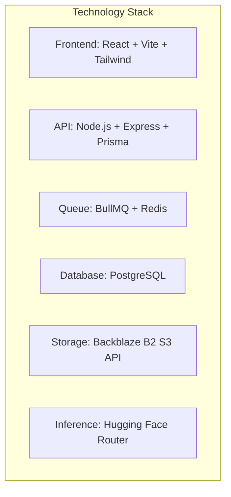

# AI-Powered Media Processing Microservice: Detailed Report

This comprehensive report details the design decisions, technology stack evaluations, constraints, and solutions implemented during the development and deployment of the **MediaProcessor.AI** platform. It aligns directly with the requirements outlined in the evaluation task and details the architectural transitions, blockers resolved, and future optimizations.

---

## 1. Task Requirements Coverage

The table below maps the explicit requirements from the task PDF to their corresponding implementation in our codebase:

| Task PDF Requirement | Implementation Status & Details | Code References / Locations |
| :--- | :--- | :--- |
| **Authentication**: Users must be able to sign up and log in. Reject unauthenticated requests. | Stateless JWT-based authentication. Users sign up/login via POST endpoints, receiving a signed token valid for 24h. Middlewares intercept and verify tokens. | [auth.controller.ts](file:///c:/Users/geeta/OneDrive/Desktop/interview_task/backend/src/controllers/auth.controller.ts)<br>[auth.middleware.ts](file:///c:/Users/geeta/OneDrive/Desktop/interview_task/backend/src/middlewares/auth.middleware.ts) |
| **File Upload**: Accept JPG, PNG, and WEBP formats only. Reject others. | Handled via Express middleware utilizing `multer` with file filter validation checking file extensions and MIME types. | [upload.middleware.ts](file:///c:/Users/geeta/OneDrive/Desktop/interview_task/backend/src/middlewares/upload.middleware.ts) |
| **File Size Limit**: Maximum file size: 5MB. Enforce at API layer. | Multer limits configured with `limits: { fileSize: 5 * 1024 * 1024 }` (5MB). Exceeding uploads return a strict `LIMIT_FILE_SIZE` error code. | [upload.middleware.ts](file:///c:/Users/geeta/OneDrive/Desktop/interview_task/backend/src/middlewares/upload.middleware.ts) |
| **Job ID Assignment**: Return unique Job ID immediately. Do not make the user wait. | The API creates a database record in `pending` status, pushes the job to the Redis queue, and immediately returns the Job ID (`202 Accepted` response). | [job.controller.ts](file:///c:/Users/geeta/OneDrive/Desktop/interview_task/backend/src/controllers/job.controller.ts#L63-L100) |
| **Frontend Dashboard**: Sign up/login, upload image, view history, click to see full results, and retry a failed job. | Fully functional React single page application with modern UI containing dashboard charts, history page, active modal details, and retry buttons. | [Dashboard.tsx](file:///c:/Users/geeta/OneDrive/Desktop/interview_task/frontend/src/pages/Dashboard.tsx)<br>[History.tsx](file:///c:/Users/geeta/OneDrive/Desktop/interview_task/frontend/src/pages/History.tsx)<br>[UploadPage.tsx](file:///c:/Users/geeta/OneDrive/Desktop/interview_task/frontend/src/pages/UploadPage.tsx) |
| **UI Polling**: Reflect job status updates in the UI via polling or WebSockets. | Handled via React Query (`@tanstack/react-query`) with an active polling interval of 5 seconds on the jobs list. It automatically halts polling once all jobs reach `completed` or `failed`. | [Dashboard.tsx](file:///c:/Users/geeta/OneDrive/Desktop/interview_task/frontend/src/pages/Dashboard.tsx)<br>[History.tsx](file:///c:/Users/geeta/OneDrive/Desktop/interview_task/frontend/src/pages/History.tsx) |
| **Flagged Content & Alerts**: Mark job `flagged: true` and store flagged category. Surface distinctly and notify the user. | If content safety checks fail, the worker marks the job as flagged. The UI shows a red badge with the flag category. The user gets an in-app persistent notification alert. | [job.worker.ts](file:///c:/Users/geeta/OneDrive/Desktop/interview_task/backend/src/workers/job.worker.ts#L90-L102)<br>[NotificationsPage.tsx](file:///c:/Users/geeta/OneDrive/Desktop/interview_task/frontend/src/pages/NotificationsPage.tsx) |
| **Docker Compose**: Provide a `docker-compose.yml` to spin up the full system locally. | Orchestrates five services: `postgres` database, `redis` queue, `api` web server, `worker` background process, and `frontend` React dev server. | [docker-compose.yml](file:///c:/Users/geeta/OneDrive/Desktop/interview_task/docker-compose.yml) |

---

## 2. Technical Stack Decisions & Rationale

Here is the evaluation of the choices made for each tier of the microservice, comparing the options considered and explaining the final decision:



### A. Application Tier: Node.js + Express + TypeScript vs. Python (FastAPI/Flask)
* **Options Considered**: Node.js/Express, Python/FastAPI, NestJS.
* **Why Node.js/Express + TypeScript**: 
  - **Single Language Ecosystem**: Allows shared TypeScript types and data structures across the API, Worker, and Frontend (e.g., sharing the OpenAPI model schemas).
  - **IO-Bound Performance**: The API server's primary bottleneck is handling concurrent multipart uploads, database transactions, and queue enqueueing. Node’s event loop performs exceptionally well under high I/O throughput.
  - **Prisma Integration**: Prisma is one of the most mature ORMs for TypeScript, providing instant type safety and database auto-completion.

### B. Database: PostgreSQL (PERN Stack) vs. MongoDB (MERN Stack)
* **Options Considered**: PostgreSQL (relational), MongoDB (document-based).
* **Why PostgreSQL**:
  - **Relational Integrity**: Essential for modeling strict relationships between `users`, `jobs`, and `notifications`. Cascading deletes (`onDelete: Cascade`) are native and atomic, ensuring that deleting a user cleanly purges their jobs and notifications.
  - **Transaction Support**: Creating a job and triggering notification updates require ACID transactional safety to prevent data drift or orphaned jobs.
  - **Type-Safe ORM (Prisma)**: Enables declarative migrations (`schema.prisma`) which generate typed clients automatically.
* **Why not MongoDB**: Document-based databases lack rigid schemas and foreign key relationship enforcements at the database level. Since the job metadata requires reliable relations to users and notifications, a relational engine is the correct architectural choice.

### C. Queue System: Redis + BullMQ vs. RabbitMQ vs. AWS SQS
* **Options Considered**: BullMQ + Redis, RabbitMQ, AWS SQS.
* **Why Redis + BullMQ**:
  - **High Performance**: Redis stores the queue state in memory, allowing sub-millisecond job scheduling operations.
  - **Feature-Rich SDK**: BullMQ is the most robust queue library for Node.js. It handles exponential backoff retries, rate-limiting, job priorities, concurrency controls, and state transitions (active, completed, failed) out of the box.
  - **Visual GUI Support**: Integrates seamlessly with Bull-Board for debugging queues.
* **Why not AWS SQS / RabbitMQ**: SQS lacks support for easy local Docker-compose testing without complex localstack configs. RabbitMQ requires AMQP protocol clients which are more tedious to implement and configure for complex retry-backoffs compared to the developer-friendly BullMQ API.

### D. File Storage Strategy: S3-Compatible Storage vs. Local Shared Volume
* **Options Considered**: Backblaze B2 (S3 API), Cloudflare R2, Shared Docker Volume.
* **Why S3-Compatible Cloud Storage**:
  - **Horizontal Scalability**: A shared Docker volume binds the API and Worker containers to the same physical virtual machine. If the API and Worker cannot share a filesystem, they cannot be deployed on separate servers, scaled out individually, or run in serverless container clusters (e.g. AWS ECS Fargate, GCP Cloud Run, or Vercel). By using S3-compatible object storage, both processes are completely stateless and can run anywhere.
  - **Ephemeral Disk Footprint**: The local file is deleted from the API container as soon as it uploads to S3, and the Worker downloads it to `/tmp` and deletes it in a `finally` block, keeping container disk usage at zero.

---

## 3. Storage Blockers & Decision: Backblaze B2 vs. Cloudflare R2

During development, the architectural plan was to utilize **Cloudflare R2** due to its zero egress fee model. However, a significant blocker arose:

### The Cloudflare R2 Blocker
> [!WARNING]
> **Billing Verification Blocker**: Creating an R2 bucket requires an active Cloudflare billing account. Even though several Visa and Mastercard credit cards were tried, the Cloudflare payment gateway repeatedly failed and refused to verify the accounts. This is a known, recurring issue with Cloudflare's billing system in certain regions.

### The Backblaze B2 Solution
To bypass the Cloudflare credit card block, we chose **Backblaze B2** with its S3-Compatible API. Backblaze provides:
- Instant bucket creation without restrictive initial credit card checks.
- Full S3 SDK compatibility (`@aws-sdk/client-s3`).
- High reliability and extremely low cost (similar to R2, with a generous free tier of 10GB).

### Private Bucket Architecture & Streamed Image Loading
Exposing user-uploaded images publicly via a bucket URL is a major security risk. It allows unauthorized users to scrap data, hotlink files, and view private documents. 

To solve this, we implemented a **fully private bucket configuration**:
1. **Private Access Control**: The Backblaze B2 bucket is configured as **Private**. Direct HTTP access to the object URL (e.g., `https://f000.backblazeb2.com/file/...`) returns an XML Access Denied error.
2. **Authenticated Express Endpoint**: When the frontend requests an image, it requests the backend endpoint `/jobs/:id/image`, sending the user's JWT authorization header.
3. **Ownership Verification**: The `job.controller.ts` intercepts this request, queries the database, and verifies that the `userId` in the JWT token matches the `userId` of the requested Job:
   ```typescript
   if (job.userId !== req.user.id) {
     return res.status(403).json({ error: { message: "You do not have permission to access this job's image." } });
   }
   ```
4. **On-Demand Stream Pipe**: Once authorized, the API server initiates an S3 `GetObjectCommand` stream from the private Backblaze bucket and pipes the raw binary stream directly into the Express HTTP response object:
   ```typescript
   const command = new GetObjectCommand({ Bucket: bucketName, Key: filename });
   const response = await client.send(command);
   res.setHeader('Content-Type', response.ContentType || 'image/jpeg');
   const bodyStream = response.Body as Readable;
   bodyStream.pipe(res);
   ```
This design ensures that:
- User files are **never exposed publicly** on the web.
- Image URLs are only accessible to authenticated owners.
- The frontend doesn't need complex AWS credentials; it simply uses standard JWT headers on image load.

---

## 4. Google Cloud Vision Constraint & AI Endpoint Decisions

The task PDF recommended using the **Google Cloud Vision API** for object detection and safety checks, and the **Hugging Face Inference API** for image captioning. 

### The Google Cloud Vision Blocker
> [!CAUTION]
> **Financial & Billing Constraint**: Google Cloud Vision API requires a Google Cloud Platform billing profile. GCP now demands active billing verification and a mandatory prepaid balance of **1,000 INR (Indian Rupees)** to activate the APIs. This is a significant blocker for local verification, deployment testing, and open-source project review.

### The Hugging Face Serverless Alternative
To overcome this financial blocker while maintaining a zero-cost local setup, we configured the AI pipeline to use **Hugging Face Serverless Inference Endpoints** for all three processing steps. This is powered by a rotating Hugging Face API key pool.

1. **Step 1: Image Captioning**:
   - **Model**: `meta-llama/Llama-4-Scout-17B-16E-Instruct:groq` (or configurable model).
   - **Method**: Sends the image as a base64 Data URL alongside a prompt requesting a one-sentence caption.
2. **Step 2: Object/Label Detection**:
   - **Model**: `facebook/detr-resnet-50` (or `google/vit-base-patch16-224` for labels).
   - **Method**: Object detection models return bounding boxes and class labels. The service filters these to extract a unique list of detected objects.
3. **Step 3: Content Safety Check**:
   - **Model**: `Falconsai/NSFW_image_detection` (or a classification model).
   - **Method**: Classifies the image into `nsfw` or `normal`. If the confidence score for `nsfw` exceeds **0.65** (configurable), the image is flagged, and the flag category is set to `'NSFW'`.

### Future Google Cloud Vision Implementation Plan
If budget permits and a GCP account is configured, swapping Hugging Face for Google Cloud Vision is extremely straightforward due to the modular design of `ai.service.ts`.

#### Step 1: Install GCP SDK
```bash
npm install @google-cloud/vision
```
#### Step 2: Configure Environment Variables
```env
GOOGLE_APPLICATION_CREDENTIALS=/path/to/gcp-key.json
```
#### Step 3: Implement Google Cloud Vision in `safety.service.ts`
```typescript
import vision from '@google-cloud/vision';
const client = new vision.ImageAnnotatorClient();

export async function classifySafetyWithGCP(localFilePath: string): Promise<SafetyResult> {
  const [result] = await client.safeSearchDetection(localFilePath);
  const detections = result.safeSearchAnnotation;

  if (!detections) {
    throw new Error('Safe Search annotation failed.');
  }

  // Google safe search returns: UNKNOWN, VERY_UNLIKELY, UNLIKELY, POSSIBLE, LIKELY, VERY_LIKELY
  const flaggedLevels = ['LIKELY', 'VERY_LIKELY'];
  
  const isFlagged = 
    flaggedLevels.includes(detections.adult || '') ||
    flaggedLevels.includes(detections.medical || '') ||
    flaggedLevels.includes(detections.spoof || '') ||
    flaggedLevels.includes(detections.violence || '') ||
    flaggedLevels.includes(detections.racy || '');

  let flagCategory = null;
  if (isFlagged) {
    if (flaggedLevels.includes(detections.adult || '')) flagCategory = 'Adult';
    else if (flaggedLevels.includes(detections.violence || '')) flagCategory = 'Violence';
    else if (flaggedLevels.includes(detections.racy || '')) flagCategory = 'Racy';
    else flagCategory = 'Unsafe';
  }

  return { flagged: isFlagged, flagCategory };
}
```

### Pre-Inference Image Optimization with Sharp
Uploading raw 5MB digital images to external AI endpoints wastes bandwidth, hits payload size limits, and slows down response times. 

To solve this, our worker uses **Sharp** to optimize the image in-memory before sending it to the Hugging Face API:
- **Resizing**: Constrains the image to a maximum edge of **768px** (`fit: 'inside'`).
- **Compression**: Converts the image into a progressive **JPEG** with a quality factor of **78%**.
- **Payload cap**: Ensures that the resulting image size stays below **900KB**.
This reduces payload sizes by up to **90%**, ensuring that inference requests complete in under 2 seconds.

---

## 5. UI Performance & Responsiveness Optimizations

To make the application feel lightning-fast and native, several critical performance optimizations were recently implemented:

### 1. Auth Caching for Instant Page Renders
* **Problem**: Previously, when navigating between pages or refreshing, the app displayed a blocking full-screen loading spinner. This was caused by the app waiting for the API response from `/auth/me` to verify session credentials.
* **Fix**: The authenticated user's profile metadata is cached in `localStorage` upon login. On app boot or page refresh, the user is instantly rendered from this local cache.
* **Revalidation**: The application still performs the `/auth/me` call in the background. If the token is expired or revoked, it silently clears the cache and redirects to `/login`. This guarantees **instant loads** without compromising security.

### 2. Code Splitting via `React.lazy()` & `Suspense`
* **Problem**: The frontend bundle included heavy rendering and logic libraries like Chart.js (used in the dashboard). Loading these libraries on the landing page or login screen slowed down initial page interactive metrics.
* **Fix**: Implemented Route-based code splitting. The core router imports pages asynchronously:
  ```typescript
  const DashboardPage = React.lazy(() => import('./pages/DashboardPage'));
  ```
  This splits the application into small chunk files. Heavy libraries like Chart.js are now **only loaded** when the user logs in and views the Dashboard, reducing the initial JS bundle size dramatically.

### 3. Production Keep-Alive Pings
* **Problem**: Render's free tier spins down containers after 15 minutes of inactivity. When a user visits the app after a quiet period, they encounter a **30-50 second cold start delay** while Render pulls the image and boots the backend.
* **Fix**: Built a background keep-alive loop in the frontend. When running in production, the browser fires a lightweight HTTP GET request to the API `/health` endpoint every **4 minutes**. This activity prevents Render's idle-detection timer from triggering, ensuring the API is **always warm** and responsive.

### 4. Collapsible Hamburger Menu on Mobile
* **Problem**: On mobile screens, the header navigation layout overlapped the logo and welcome text, breaking visual layouts.
* **Fix**: Implemented a responsive mobile header utilizing a stateful hamburger menu button (`md:hidden`). Standard navigation links are hidden on small viewports and placed inside a responsive slide-down menu, while desktop views retain the standard horizontal navbar layout.

---

## 6. Microservices Deployment Stack & Free-Tier Port Binding

```
                     +----------------------------+
                     |       Vercel Hosting       |
                     |  (React Frontend, Vite JS) |
                     +--------------+-------------+
                                    |
                                    | HTTP Requests (JWT Auth)
                                    v
                     +----------------------------+
                     |   Render Web Service API   |
                     |   (Express Server, Port 5000)
                     +---+--------------------+---+
                         |                    |
       Uploads / Streams |                    | Read/Write Jobs
                         v                    v
+------------------------+---+        +-------+--------------------+
|     Backblaze B2 S3        |        |    Neon Serverless DB      |
|    (Private Object Storage)|        |   (PostgreSQL Database)    |
+------------------------+---+        +----------------------------+
                         ^
        Downloads Object |
                         |
                     +---+--------------------+
                     | Render Web Service Worker|
                     | (Dummy HTTP Server, Port 5001)
                     +-----------+------------+
                                 |
                                 | Job Event Triggers
                                 v
                     +-----------+------------+
                     |      Upstash Redis     |
                     |  (Serverless BullMQ)   |
                     +------------------------+
```

### Why Worker is Deployed as a Render Web Service
> [!NOTE]
> **Render Pricing Constraint**: Render's specialized **Background Worker** services are a paid service type and do not offer a Free Tier. To maintain a completely free deployment stack, the Worker was deployed as a standard **Render Web Service**.
>
> **The Port Binding Workaround**: Render Web Services require containers to bind to a designated port (`PORT`) and respond to HTTP health checks. To satisfy this requirement and prevent deployment timeouts, the Worker starts a lightweight dummy HTTP server in `worker.ts` that listens on port `5001` (avoiding port conflicts with the API service):
> ```typescript
> import http from 'http';
> const dummyPort = process.env.PORT || 5001;
> http.createServer((req, res) => {
>   res.writeHead(200, { 'Content-Type': 'text/plain' });
>   res.end('Worker is running');
> }).listen(dummyPort, () => {
>   console.log(`[Worker Service] Dummy server listening on port ${dummyPort} to pass Render port detection.`);
> });
> ```

- **Frontend**: Deployed on **Vercel** for globally edge-cached static asset delivery.
- **API & Worker Services**: Deployed as independent **Web Services** on **Render (Free Tier)**.
- **Database**: Hosted on **Neon Serverless PostgreSQL**, scaling compute resources to zero during periods of inactivity to minimize costs.
- **Message Queue**: Hosted on **Upstash Serverless Redis**, providing low-latency queue storage with a zero-management serverless plan.

---

## 7. Future Improvisations & Roadmap

Should more resources and development time be allocated, the system can be improved as follows:

1. **Parallel AI Inference Pipelines**:
   - *Current*: The worker calls Captioning, then Object Detection, then Safety Checks sequentially. This takes ~10 seconds.
   - *Improvement*: Fire all three Hugging Face / GCP Vision requests in parallel using `Promise.all()`. This would cut processing times to under 4 seconds.
2. **WebSocket Integration**:
   - *Current*: Frontend polls the API database every 5 seconds.
   - *Improvement*: Establish persistent WebSocket connections using Socket.io or AWS API Gateway WebSockets, allowing the worker to push status changes to the client instantly.
3. **CDN Caching with Signed Cookies**:
   - *Current*: API server acts as a proxy, fetching and streaming files from B2 on every load.
   - *Improvement*: Set up a Cloudflare CDN in front of Backblaze B2 and generate S3 Signed URLs or Cloudflare Signed Cookies. This allows the client to download files directly from the edge CDN securely without loading the Express API server.
4. **Webhook Support**:
   - Allow enterprise users to register a callback URL. The worker will make a POST request with the completed job payload once processing finishes.
5. **Decoupled Cron-based Recovery**:
   - Move the worker's interrupted job recovery routine out of the container boot sequence and into a scheduled task (e.g. Upstash QStash cron) to prevent query lock collisions when scaling workers horizontally.
